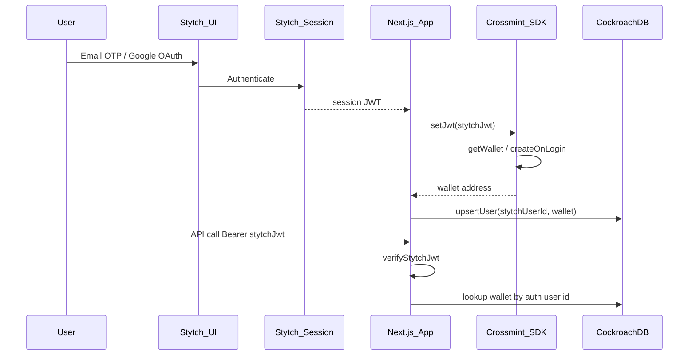
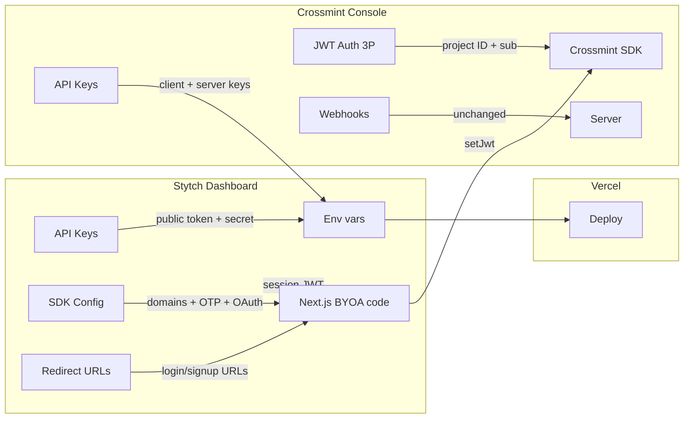

# Stytch + Crossmint BYOA Auth Blueprint

**Clarification:** Crossmint's featured provider is **[Stytch](https://stytch.com)** (not "Stitch"). The repo's Phase 1 was "Stytch BYOA Auth + Crossmint Wallet Separation"; the DB still has `stytch_user_id → crossmint_user_id` migration logic in [`lib/cockroachdb.ts`](../lib/cockroachdb.ts).

---

## Target architecture



| Layer           | Today                                                                                      | After BYOA                                                                                            |
| --------------- | ------------------------------------------------------------------------------------------ | ----------------------------------------------------------------------------------------------------- |
| Login UI        | `EmbeddedAuthForm` in [`CrossmintLoginModal.tsx`](../components/auth/CrossmintLoginModal.tsx) | Stytch UI (`StytchLogin` or headless OTP/OAuth)                                                       |
| Session / JWT   | `CrossmintAuthProvider` + cookie refresh routes                                            | Stytch session (`@stytch/nextjs` or `@stytch/react`)                                                  |
| Wallets         | `CrossmintWalletProvider` + `createOnLogin`                                                | **Unchanged** — JWT bridged via `useCrossmint().setJwt()`                                             |
| Server API auth | [`verifyCrossmintJwt`](../lib/crossmintAuth.ts) via Crossmint JWKS                            | **Stytch JWKS** verification (new `lib/stytchAuth.ts`)                                                |
| User ID in DB   | `crossmint_user_id` column                                                                 | Store **Stytch `user_id`** (column name can stay for now — it's already the generic external-ID slot) |

Crossmint reference: [Bring Your Own Auth](https://docs.crossmint.com/wallets/guides/bring-your-own-auth) and [JWT Authentication — 3P providers](https://docs.crossmint.com/introduction/platform/api-keys/jwt-authentication).

---

## Phase 0 — Dashboard runbook (after code changes)

Do these steps **after** the Stytch BYOA code lands, in this order: **Stytch Test → Crossmint Staging → local smoke test → Stytch Live → Crossmint Production → Vercel prod env**.

Stytch docs index: [stytch.com/docs/llms.txt](https://stytch.com/docs/llms.txt). Crossmint BYOA: [Bring Your Own Auth](https://docs.crossmint.com/wallets/guides/bring-your-own-auth).

---

### Step 1 — Stytch Dashboard (Test environment)

Open [stytch.com/dashboard](https://stytch.com/dashboard). Confirm you are in **Test** (toggle top-left), on a **B2C Consumer** project.

#### 1a. Project Settings → API Keys

Copy these into `.env.local` (and later Vercel Preview):

| Dashboard field | Env var | Example prefix |
|-----------------|---------|----------------|
| Public token | `NEXT_PUBLIC_STYTCH_PUBLIC_TOKEN` | `public-token-test-...` |
| Secret | `STYTCH_SECRET` | `secret-test-...` |
| Project ID | `STYTCH_PROJECT_ID` | `project-test-...` |

`STYTCH_PROJECT_ID` is also what you paste into Crossmint (Step 2).

#### 1b. Configuration → SDK Configuration

1. **Authorized domains** — add every origin your app runs on:
   - `http://localhost:3000` (local dev)
   - `https://finance.creativeplatform.xyz` (prod)
   - Your Vercel preview pattern if used (e.g. `https://bank-*.vercel.app` — Stytch Test allows wildcards in the allowlist)
2. **Auth methods** — enable what the app uses (match current Crossmint login):
   - **Email OTPs** (or Email magic links if you choose that product in code)
   - **OAuth** → enable **Google**
     - **Test env:** Stytch's shared Google test client works — no Google Cloud console setup needed
3. **Session duration** — set to your preference (e.g. 60 min; align with `sessionOptions` in code if using `StytchLogin` config)

#### 1c. Configuration → Redirect URLs

Stytch requires **exact-match** redirect URLs registered before auth flows work ([Redirect URLs docs](https://stytch.com/docs/resources/workspace-management/redirect-urls)).

Add as both **Login** and **Signup** types:

| Environment | URLs to register |
|-------------|------------------|
| Local | `http://localhost:3000` |
| Local (if code uses `/authenticate` route) | `http://localhost:3000/authenticate` |
| Production | `https://finance.creativeplatform.xyz` |
| Production (if `/authenticate` route) | `https://finance.creativeplatform.xyz/authenticate` |
| Vercel previews (optional) | `https://<your-preview-host>.vercel.app` per preview, or wildcard in Test allowlist |

**Important:** No trailing slash. Crossmint's Stytch quickstart uses the root URL (`http://localhost:3000`), not `/callback`.

Set one URL as **default** for Login and Signup (non-wildcard) — wildcards cannot be used as the default redirect.

#### 1d. OAuth → Google (Test)

Under **Configuration → OAuth** (or SDK Configuration → OAuth):

1. Enable Google provider.
2. For Test, use Stytch's built-in test client unless you need a custom Google OAuth app.

---

### Step 2 — Crossmint Console (Staging / Test)

Open [staging.crossmint.com/console](https://staging.crossmint.com/console) → your Creative Bank project.

#### 2a. API Keys → JWT authentication

This is the critical BYOA link — Crossmint must trust Stytch-issued JWTs before `setJwt()` works.

1. Scroll to **JWT authentication**.
2. Select **3P Auth providers** (not "Crossmint Authentication").
3. Provider dropdown → **Stytch**.
4. Paste **Stytch Project ID** from Step 1a (`project-test-...`).
5. **Verifier Id** → leave as **`sub`** (Stytch user id becomes wallet `owner`).
6. Click **Save JWT auth settings**.

Reference: [Crossmint JWT Authentication — 3P providers](https://docs.crossmint.com/introduction/platform/api-keys/jwt-authentication#third-party-authentication).

#### 2b. API Keys — confirm wallet scopes

Your existing client + server keys should already have wallet scopes. Verify:

- Client key (`NEXT_PUBLIC_CROSSMINT_CLIENT_API_KEY`): wallets create/read
- Server key (`CROSSMINT_SERVER_SIDE_API_KEY`): webhooks, server wallet ops

No change needed if keys already work today.

#### 2c. Webhooks (unchanged)

Wallet transfer webhooks in [CROSSMINT_WEBHOOKS.md](./CROSSMINT_WEBHOOKS.md) are **not** auth-related. Leave `CROSSMINT_WEBHOOK_SECRET` as-is; endpoint stays `/api/webhooks/crossmint`.

#### 2d. Crossmint Auth settings (disable / stop using)

After BYOA is live, you will **no longer use** Crossmint's built-in auth UI (`EmbeddedAuthForm`). You do not need to delete anything in Crossmint — just ensure JWT auth is set to **Stytch**, not Crossmint Authentication.

---

### Step 3 — Vercel environment variables (Preview / local first)

Add to `.env.local` and Vercel **Preview** environment:

```bash
# Stytch (Test)
NEXT_PUBLIC_STYTCH_PUBLIC_TOKEN=public-token-test-...
STYTCH_SECRET=secret-test-...
STYTCH_PROJECT_ID=project-test-...

# Crossmint (unchanged — staging key for preview)
NEXT_PUBLIC_CROSSMINT_CLIENT_API_KEY=...
CROSSMINT_SERVER_SIDE_API_KEY=...
NEXT_PUBLIC_CHAIN_ID=base-sepolia   # dev/preview

# Optional during migration
AUTH_PROVIDER=hybrid   # stytch | hybrid | crossmint
```

Redeploy preview after saving env vars.

---

### Step 4 — Local smoke test (before touching production dashboards)

```bash
pnpm dev
```

Verify:

1. Stytch login modal appears (not Crossmint `EmbeddedAuthForm`).
2. Email OTP or Google sign-in succeeds.
3. Wallet loads / creates on Base Sepolia.
4. `/api/user/profile` returns 200 with Stytch Bearer JWT.
5. Logout clears session and wallet.

If wallet fails with auth error → re-check Step 2a (Stytch Project ID must match **Test** env, and Crossmint staging key must be from the same project where you saved JWT settings).

---

### Step 5 — Stytch Dashboard (Live environment)

When preview works, switch Stytch dashboard to **Live** (top-left toggle).

Repeat Step 1 for Live:

| Item | Live value |
|------|------------|
| Public token | `public-token-live-...` → `NEXT_PUBLIC_STYTCH_PUBLIC_TOKEN` (prod) |
| Secret | `secret-live-...` → `STYTCH_SECRET` (prod) |
| Project ID | `project-live-...` → `STYTCH_PROJECT_ID` (prod) + Crossmint prod |
| Authorized domains | `https://finance.creativeplatform.xyz` only (no localhost) |
| Redirect URLs | `https://finance.creativeplatform.xyz` (+ `/authenticate` if used) |
| Google OAuth | **Requires your own Google Cloud OAuth client** — configure in Stytch Live OAuth settings (not the shared test client) |

---

### Step 6 — Crossmint Console (Production)

Open [crossmint.com/console](https://crossmint.com/console) → production project.

Repeat Step 2a with **Live** Stytch Project ID (`project-live-...`).

Confirm:

- `NEXT_PUBLIC_CHAIN_ID` is `base` in production (app forces mainnet in prod).
- Production Crossmint client + server API keys unchanged.
- Webhook URL points to `https://finance.creativeplatform.xyz/api/webhooks/crossmint`.

---

### Step 7 — Vercel Production environment

Set **Production** env vars in Vercel (replace Test tokens with Live):

```bash
NEXT_PUBLIC_STYTCH_PUBLIC_TOKEN=public-token-live-...
STYTCH_SECRET=secret-live-...
STYTCH_PROJECT_ID=project-live-...
AUTH_PROVIDER=stytch          # or hybrid during migration window
```

Promote / deploy to production. Run the same smoke test on prod URL.

---

### Step 8 — Post-launch dashboard checks

| Check | Where | What to verify |
|-------|-------|----------------|
| Session minting | Stytch → Logs / Events | Login events appear after sign-in |
| Wallet owner | Crossmint Console → Wallets | New wallets show owner = Stytch `user_id` |
| User ledger | CockroachDB `users` table | `crossmint_user_id` column holds Stytch id; `wallet_address` populated |
| Existing users | App + DB | Same email → same wallet (email re-link in `upsertUser`) |
| Google prod login | Stytch Live OAuth | Custom Google client authorized redirect URIs match Stytch |
| Hybrid window | Vercel `AUTH_PROVIDER=hybrid` | Old Crossmint Auth sessions still work until expiry |

---

### Dashboard ↔ code mapping (quick reference)



---

## Phase 1 — Dependencies and provider tree

**Install:** `@stytch/nextjs` (App Router) or `@stytch/react` — prefer `@stytch/nextjs` for cookie-based sessions in Next.js 16.

**Refactor [`app/providers.tsx`](../app/providers.tsx):**

Remove `CrossmintAuthProvider` (and its `loginMethods`, `refreshRoute`, `logoutRoute`). New structure:

```tsx
<StytchProvider stytch={stytchClient}>
  <CrossmintProvider apiKey={...}>
    <CrossmintWalletProvider createOnLogin={{ chain, signers, recovery }}>
      <StytchJwtSync />   {/* new: bridges Stytch session → Crossmint */}
      <AuthProvider>
        {children}
      </AuthProvider>
    </CrossmintWalletProvider>
  </CrossmintProvider>
</StytchProvider>
```

**New `components/auth/StytchJwtSync.tsx`:**

- Read Stytch session JWT (`useStytchSession` or equivalent).
- Call `useCrossmint().setJwt(jwt)` whenever session changes.
- On logout / expired session, call `setJwt(null)`.

`createOnLogin` on `CrossmintWalletProvider` should continue to auto-provision wallets once JWT is set (same passkey + email recovery config you have today).

---

## Phase 2 — Auth context and login UI

### [`context/AuthContext.tsx`](../context/AuthContext.tsx)

Replace `useCrossmintAuth()` with Stytch hooks:

| Field        | Source                                                                 |
| ------------ | ---------------------------------------------------------------------- |
| `status`     | Map Stytch session state → `logged-in` / `logged-out` / `initializing` |
| `user.id`    | Stytch `user_id`                                                       |
| `user.email` | Stytch user email                                                      |
| `jwt`        | Stytch session JWT (sent to your API routes)                           |
| `logout`     | `stytch.session.revoke()`                                              |

Keep `refreshUserProfile()` and phone-verification enrichment — it hits `/api/user/profile` with the Bearer token.

### Login modal

Replace [`CrossmintLoginModal.tsx`](../components/auth/CrossmintLoginModal.tsx) content:

- Remove `EmbeddedAuthForm`.
- Render Stytch's prebuilt `<StytchLogin />` **or** custom email OTP + Google buttons using Stytch headless APIs (better match for your existing `Modal` + CREATIVE Finance branding).

[`components/Login.tsx`](../components/Login.tsx) stays the same pattern (auto-open modal when logged out).

---

## Phase 3 — Server-side JWT verification

**New `lib/stytchAuth.ts`:**

- Use Stytch server SDK (`stytch` npm package) or `jose` + Stytch JWKS endpoint to verify session JWTs.
- Extract `user_id` from verified token.

**Update [`lib/apiAuth.ts`](../lib/apiAuth.ts):**

- `requireAuthedWallet` should verify **Stytch JWT** (not Crossmint JWKS).
- Lookup remains: `SELECT wallet_address FROM users WHERE crossmint_user_id = $1` (value is now Stytch user id).

**Optional hybrid verifier** (recommended if you have live Crossmint Auth users):

```ts
// Try Stytch first, fall back to verifyCrossmintJwt during migration window
```

Controlled by env flag e.g. `AUTH_PROVIDER=stytch|hybrid|crossmint`.

### Routes to remove or deprecate

- [`app/api/auth/crossmint/refresh/route.ts`](../app/api/auth/crossmint/refresh/route.ts) — Stytch manages refresh
- [`app/api/auth/crossmint/logout/route.ts`](../app/api/auth/crossmint/logout/route.ts) — client-side Stytch revoke

Keep [`lib/crossmint-server.ts`](../lib/crossmint-server.ts) only if still needed for webhooks; not for user login.

---

## Phase 4 — User ledger and migration

### Schema constraint (read before changing `upsertUser`)

The `users` table has **two uniqueness guarantees** ([`lib/cockroachdb.ts`](../lib/cockroachdb.ts)):

- `crossmint_user_id` — PRIMARY KEY
- `idx_users_wallet_address` — UNIQUE on `wallet_address`

Current [`upsertUser`](../server-actions/getTransactions.ts) only handles `ON CONFLICT (crossmint_user_id)`. That works for repeat logins with the same auth id, but **breaks on migration**:

1. Existing row: `crossmint_user_id = cm_old`, `wallet_address = 0xabc`, `email = user@example.com`
2. User signs in via Stytch: new id `user-test-xyz`, Crossmint returns the **same** wallet `0xabc`
3. Naive `INSERT (user-test-xyz, 0xabc, …)` → **`unique_violation` on `idx_users_wallet_address`** because `0xabc` is already owned by `cm_old`

Email-only re-linking described as "insert if no Stytch id match" is **not sufficient** — you must update the existing row in place, not insert a duplicate wallet.

### Recommended `upsertUser` algorithm

Use a **multi-step, wallet-first** flow inside a **single pinned connection** transaction. [`getPool()`](../lib/cockroachdb.ts) returns a shared `pg` `Pool` — `pool.query("BEGIN")` and subsequent queries may run on **different connections**, so they are not one atomic transaction. Pin a client with `pool.connect()` and run all statements on that client.

When `crossmint_user_id` changes during re-link, also update or remove rows in [`phone_otp_challenges`](../lib/cockroachdb.ts) (PK = `crossmint_user_id`). Otherwise in-flight Coinbase phone OTP lookups ([`/api/user/phone/send`](../app/api/user/phone/send/route.ts), [`verify`](../app/api/user/phone/verify/route.ts)) will miss the legacy id.

```ts
// Pseudocode — implement in upsertUser (server-actions/getTransactions.ts)
async function upsertUser(authUserId, walletAddress, email?, phone?) {
  const wallet = walletAddress.toLowerCase();
  const pool = getPool();
  const client = await pool.connect();

  try {
    await client.query("BEGIN");

    // 1. Already linked to this auth id? (happy path)
    const byId = await client.query(
      "SELECT 1 FROM users WHERE crossmint_user_id = $1",
      [authUserId]
    );
    if (byId.rows.length) {
      await client.query(
        `UPDATE users SET
           wallet_address = $2,
           email = COALESCE($3, email),
           phone_number = COALESCE($4, phone_number),
           updated_at = now()
         WHERE crossmint_user_id = $1`,
        [authUserId, wallet, email ?? null, phone ?? null]
      );
      await client.query("COMMIT");
      return;
    }

    // 2. Migration: same wallet, new auth id (BYOA re-link)
    const byWallet = await client.query(
      "SELECT crossmint_user_id FROM users WHERE wallet_address = $1",
      [wallet]
    );
    if (byWallet.rows.length) {
      const legacyAuthId = byWallet.rows[0].crossmint_user_id as string;
      if (legacyAuthId !== authUserId) {
        await relinkAuthUserId(client, legacyAuthId, authUserId);
      }
      await client.query(
        `UPDATE users SET
           crossmint_user_id = $1,
           email = COALESCE($2, email),
           phone_number = COALESCE($3, phone_number),
           updated_at = now()
         WHERE wallet_address = $4`,
        [authUserId, email ?? null, phone ?? null, wallet]
      );
      await client.query("COMMIT");
      return;
    }

    // 3. Migration: same email, possibly new wallet (less common)
    if (email) {
      const byEmail = await client.query(
        "SELECT crossmint_user_id, wallet_address FROM users WHERE lower(email) = lower($1)",
        [email]
      );
      if (byEmail.rows.length === 1) {
        const legacyAuthId = byEmail.rows[0].crossmint_user_id as string;
        if (legacyAuthId !== authUserId) {
          await relinkAuthUserId(client, legacyAuthId, authUserId);
        }
        await client.query(
          `UPDATE users SET
             crossmint_user_id = $1,
             wallet_address = $2,
             phone_number = COALESCE($3, phone_number),
             updated_at = now()
           WHERE lower(email) = lower($4)`,
          [authUserId, wallet, phone ?? null, email]
        );
        await client.query("COMMIT");
        return;
      }
      if (byEmail.rows.length > 1) {
        console.error("[upsertUser] Multiple users share email; skipping email re-link", email);
      }
    }

    // 4. Brand-new user
    await client.query(
      `INSERT INTO users (crossmint_user_id, wallet_address, email, phone_number, email_verified_at, updated_at)
       VALUES ($1, $2, $3, $4, CASE WHEN $3 IS NOT NULL THEN now() ELSE NULL END, now())
       ON CONFLICT (crossmint_user_id) DO UPDATE SET
         wallet_address = EXCLUDED.wallet_address,
         email = COALESCE(EXCLUDED.email, users.email),
         phone_number = COALESCE(EXCLUDED.phone_number, users.phone_number),
         updated_at = now()`,
      [authUserId, wallet, email ?? null, phone ?? null]
    );
    await client.query("COMMIT");
  } catch (e) {
    await client.query("ROLLBACK");
    throw e;
  } finally {
    client.release();
  }
}

/** Move or clear phone OTP challenges when auth user id changes (same transaction). */
async function relinkAuthUserId(
  client: PoolClient,
  legacyAuthId: string,
  newAuthId: string
) {
  // OTP challenges are short-lived; delete legacy row so user re-sends under new id.
  // Alternative: UPDATE phone_otp_challenges SET crossmint_user_id = $2 WHERE crossmint_user_id = $1
  // if you need in-flight OTP to survive re-link (rare during login).
  await client.query(
    `DELETE FROM phone_otp_challenges WHERE crossmint_user_id = $1`,
    [legacyAuthId]
  );
}
```

**Alternative (single statement):** add `ON CONFLICT (wallet_address) DO UPDATE SET crossmint_user_id = EXCLUDED.crossmint_user_id, …` to the INSERT. The unique index `idx_users_wallet_address` supports this. Still call `relinkAuthUserId` inside the same pinned-client transaction when the conflict updates the auth id. Prefer the explicit multi-step flow when email and wallet could diverge.

### Migration test cases (add to Phase 6)

| Scenario | Expected DB outcome |
| -------- | ------------------- |
| New Stytch user, new wallet | One INSERT, no conflict |
| Same Stytch user re-login | UPDATE via `ON CONFLICT (crossmint_user_id)` |
| Crossmint Auth user → Stytch, **same wallet** | UPDATE `crossmint_user_id` on existing row (no INSERT) |
| Crossmint Auth user → Stytch, **new wallet**, same email | UPDATE both `crossmint_user_id` and `wallet_address` on email match |
| Re-link with pending phone OTP | `phone_otp_challenges` row for legacy auth id deleted (user re-sends OTP under Stytch id) |
| Two rows same email (data bug) | Skip email path; log error; do not corrupt |

Transactions remain keyed by `wallet_address`, so ledger history survives as long as the wallet row is updated in place rather than duplicated.

### Existing Crossmint Auth users

1. **Hybrid JWT verification** for 2–4 weeks in production.
2. **Wallet-first re-linking** on first Stytch login (see algorithm above).
3. Users who only used Google on Crossmint must sign in with the same Google account on Stytch to link (email match path).

---

## Phase 5 — What stays unchanged

- [`CrossmintWalletProvider`](../app/providers.tsx) — passkeys, `createOnLogin`, chain selection
- Crossmint webhooks ([`CROSSMINT_WEBHOOKS.md`](./CROSSMINT_WEBHOOKS.md)) — wallet events, not auth
- Membership / Unlock ([`MembershipContext`](../context/MembershipContext.tsx)) — wallet-address keyed
- Coinbase onramp phone verification — still uses authed user id from session
- Aave, wagmi, Yearn integrations — wallet-address keyed

---

## Phase 6 — Testing checklist

1. **Local:** Stytch Test env + Crossmint staging key with Stytch registered as 3P provider.
2. Sign in with email OTP → wallet auto-created → `upsertUser` writes DB row.
3. Sign in with Google → same flow.
4. Protected API (`/api/user/profile`, onramp routes) accepts Stytch Bearer JWT.
5. Logout → `setJwt(null)` → wallet unloaded → login modal reappears.
6. **Re-login** → same Stytch user → same Crossmint wallet (owner = Stytch `user_id`).
7. If hybrid: existing Crossmint Auth user can still use old session until expiry.
8. **Migration:** existing Crossmint Auth row + Stytch login with same wallet → no `unique_violation`; `crossmint_user_id` updated in place.

---

## File change summary

| Action           | Files                                                                                                                               |
| ---------------- | ----------------------------------------------------------------------------------------------------------------------------------- |
| Add              | `lib/stytch.ts` (client), `lib/stytchAuth.ts` (server), `components/auth/StytchJwtSync.tsx`, `components/auth/StytchLoginModal.tsx` |
| Modify           | `app/providers.tsx`, `context/AuthContext.tsx`, `lib/apiAuth.ts`, `.env.template`, `README.md`, `CLAUDE.md`                         |
| Remove/deprecate | `CrossmintLoginModal` (or repurpose), `app/api/auth/crossmint/*` routes                                                             |
| Keep             | All wallet, webhook, membership, and DeFi code                                                                                      |

---

## Risks and mitigations

| Risk                              | Mitigation                                                                       |
| --------------------------------- | -------------------------------------------------------------------------------- |
| User gets new wallet after switch | Wallet-first + email re-link in `upsertUser`; same Google account for OAuth users |
| `unique_violation` on migration   | Never INSERT when `wallet_address` already exists — UPDATE `crossmint_user_id` on existing row ([Phase 4](#phase-4--user-ledger-and-migration)) |
| Non-atomic migration writes       | Use `pool.connect()` + single client for BEGIN/COMMIT; do not call `pool.query("BEGIN")` on a shared pool |
| Orphaned phone OTP challenges     | Call `relinkAuthUserId()` to DELETE (or UPDATE) `phone_otp_challenges` when auth id changes |
| Server rejects JWT                | Register Stytch Project ID in Crossmint Console; verify correct Test vs Live env |
| `createOnLogin` doesn't fire      | Ensure `StytchJwtSync` runs before wallet hooks; check JWT is non-null           |
| Passkey recovery email            | Pass Stytch user email into `recovery: { type: "email" }` if needed explicitly   |

Reference implementation: [Crossmint/stytch-crossmint](https://github.com/Crossmint/stytch-crossmint) (older sample, but same BYOA pattern).
